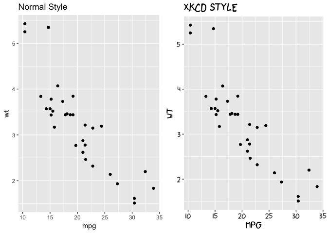
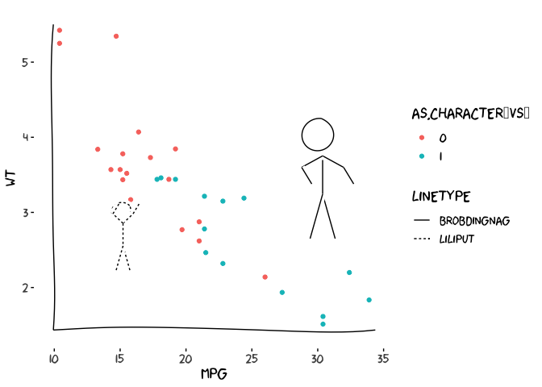
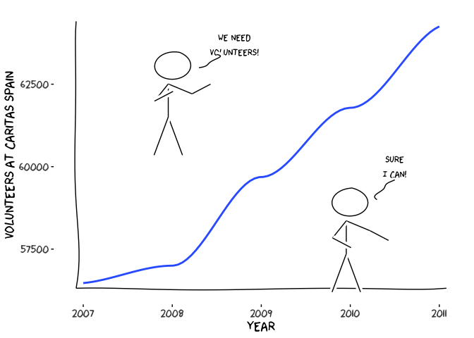
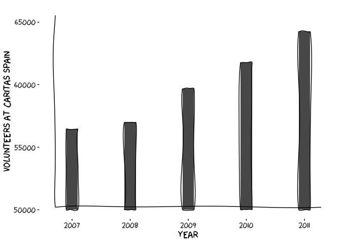
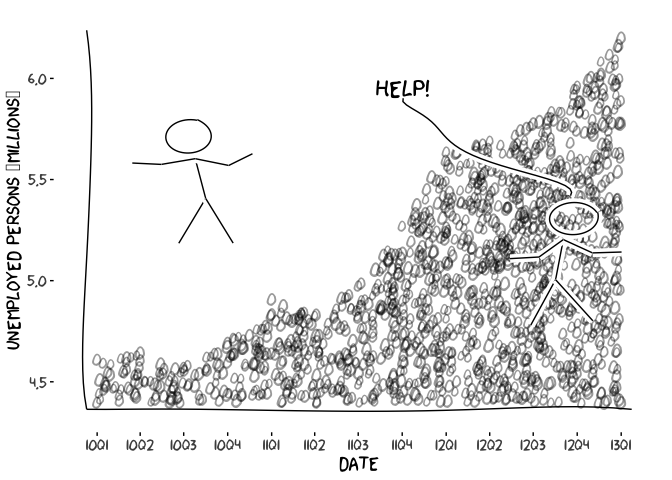
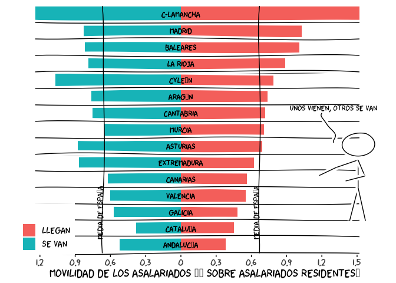
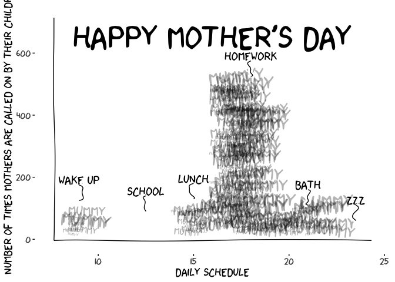

------------------------------------------------------------------------

#### Emilio Torres-Manzanera

###### Univeristy of Oviedo

------------------------------------------------------------------------

Turn normal plots into XKCD styled plots

Install
-------

    install.packages("xkcd")
    library(extrafont)
    download.file("http://simonsoftware.se/other/xkcd.ttf", 
                  dest="xkcd.ttf", mode="wb")
    system("mkdir ~/.fonts")
    system("cp xkcd.ttf  ~/.fonts")
    font_import(pattern = "[X/x]kcd", prompt=FALSE)
    fonts()
    fonttable()
    if(.Platform$OS.type != "unix") {
      ## Register fonts for Windows bitmap output
      loadfonts(device="win") 
    } else {
      loadfonts() 
    }

Then for every R script needing xkcd styling use **include** with:

    library(xkcd)

For **help**:

    vignette("xkcd-intro")

Or look at the R markdown source for this file.

Intro
-----

To create a simple

    xrange <- range(mtcars$mpg)
    yrange <- range(mtcars$wt)
    set.seed(123) # for reproducibility
    p <- ggplot() + geom_point(aes(mpg, wt), data=mtcars) + 
          xkcdaxis(xrange,yrange)
    p

### Drawing XKCD character on graph

    ratioxy <- diff(xrange)/diff(yrange)
    mapping <- aes(x, y, scale, ratioxy, angleofspine,
                   anglerighthumerus, anglelefthumerus,
                   anglerightradius, angleleftradius,
                   anglerightleg, angleleftleg, angleofneck,
                   linetype=city)
     
    dataman <- data.frame(x= c(15,30), y=c(3, 4),
                          scale = c(0.3,0.51) ,
                          ratioxy = ratioxy,
                          angleofspine =  -pi/2  ,
                          anglerighthumerus = c(pi/4, -pi/6),
                          anglelefthumerus = c(pi/2 + pi/4, pi +pi/6),
                          anglerightradius = c(pi/3, -pi/3),
                          angleleftradius = c(pi/3, -pi/3),
                          anglerightleg = 3*pi/2  - pi / 12,
                          angleleftleg = 3*pi/2  + pi / 12 ,
                          angleofneck = runif(1, 3*pi/2-pi/10, 3*pi/2+pi/10),
                          city=c("Liliput","Brobdingnag"))
     
    p <- ggplot() + geom_point(aes(mpg, wt, colour=as.character(vs)), data=mtcars) + 
      xkcdaxis(xrange,yrange) + 
      xkcdman(mapping, dataman)
    p

#### Some More Examples

##### Example Line Graphs

##### Example Bar Graphs (use xkcdrect)

##### Example Scatter Plot with Alternative Data Points

##### Example of Graph Over Time

##### Example of Horizontal Bar Graph

##### Example of Atlernative Bar Graph

_All source files in [test directory](test/xkcd-demo.Rmd)
